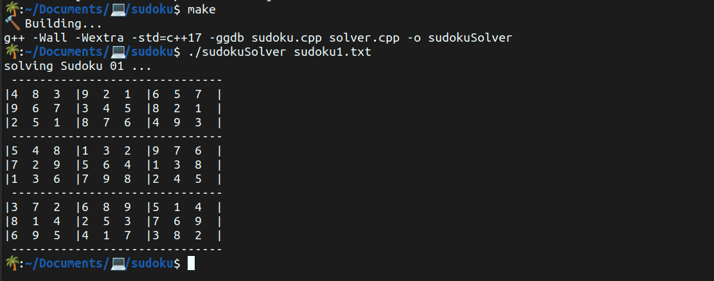

# Sudoku Solver

**command line:**
<br/>option1
> ```console
> $ g++ sudoku.cpp solver.cpp -o sudokuSolver
> $ ./sudokuSolver <file containing sudoku>
> ```

<br/>option2
> ```console
> $ g++ sudoku.cpp solver.cpp -o sudokuSolver && ./sudokuSolver <file containing sudoku>
> ```

<br/>option3
> ```console
> $ make
> $ ./sudokuSolver <file containing sudoku>
> ```
  
  #
  
  ### example
  
